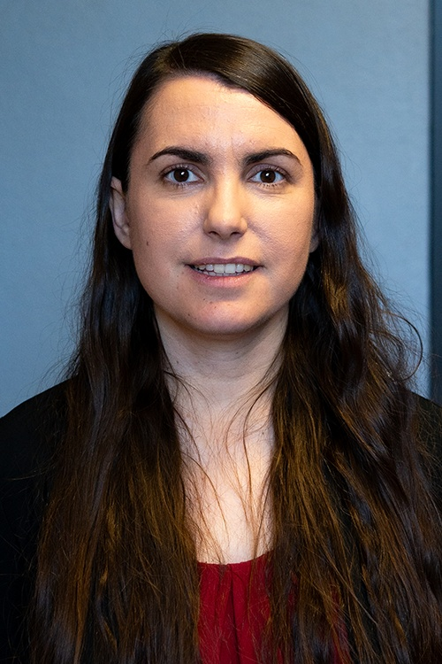

# Anabel del Val

**Role:** Assistant Professor

**Category:** Faculty

**Email:** adelvalb@umn.edu

## Research summary

del Val studies how uncertainty affects predictions of very fast, hot, chemically reacting gas flows. She uses statistical and data-based methods to improve models, identify influential inputs, and design more informative experiments.

## Easy research quiz

1. What does del Val study about flow predictions?
2. Does her work include chemically reacting flows?
3. What kind of methods help her handle uncertainty?
4. Why identify influential model inputs?
5. What does she aim to improve when designing experiments?

## Answer key

1. How uncertainty affects them.
2. Yes.
3. Statistical or data-based methods.
4. To understand which inputs most affect predictions.
5. How much useful information they provide.

## Sources and notes

AEM profile research description, paraphrased with brief plain-language explanations.

- [AEM faculty directory (name, role, email, photo)](https://cse.umn.edu/aem/aem-faculty)
- [AEM individual profile](https://cse.umn.edu/aem/anabel-del-val)
- [Original photo](https://cse.umn.edu/sites/cse.umn.edu/files/styles/folwell_full/public/Anabel%20Headshot%20for%20Website_0.png.webp?itok=dDyDhDSO)
- Retrieved: 2026-09-26
- Photo status: directory_photo

