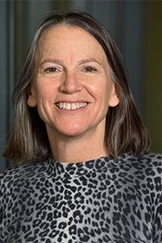

# Ellen K. Longmire

**Role:** Professor

**Category:** Faculty

**Email:** longmire@umn.edu

## Research summary

Longmire uses advanced experiments to study turbulent flows, mixtures of liquids, and flows containing particles. Her projects examine swirling eddies, particle transport and the onset of turbulence, liquid contact effects, and measurements of hypersonic reentry flows.

## Easy research quiz

1. Does Longmire mainly emphasize experimental measurements in this description?
2. What swirling structures does she identify in turbulent flows?
3. What small objects can her flows carry?
4. Does she study mixtures involving two liquids?
5. What high-speed spaceflight event appears in her research?

## Answer key

1. Yes.
2. Eddies.
3. Particles.
4. Yes.
5. Hypersonic reentry.

## Sources and notes

AEM profile research description, paraphrased with brief plain-language explanations.

- [AEM faculty directory (name, role, email, photo)](https://cse.umn.edu/aem/aem-faculty)
- [AEM individual profile](https://cse.umn.edu/aem/ellen-k-longmire)
- [Original photo](https://cse.umn.edu/sites/cse.umn.edu/files/styles/folwell_full/public/2019-01/Longmireresized.jpg.webp?itok=vVFUomHu)
- Retrieved: 2026-09-26
- Photo status: directory_photo

