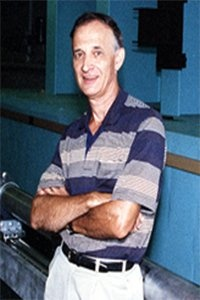

# Gordon S. Beavers

**Role:** Professor Emeritus (Retired 2006)

**Category:** Emeritus Faculty

**Email:** Not publicly listed in the current AEM directory/profile

## Research summary

Beavers' listed research areas are experimental fluid mechanics and rheological fluid mechanics. These concern measuring how fluids move and understanding how materials flow or deform when forces act on them.

## Easy research quiz

1. What is one of Beavers' listed research areas?
2. Does experimental research involve measurements?
3. What does fluid mechanics study?
4. What does rheology concern?
5. Would observing a fluid's response to an applied force fit these topics?

## Answer key

1. Experimental fluid mechanics or rheological fluid mechanics.
2. Yes.
3. How fluids move and respond to forces.
4. How materials flow or deform.
5. Yes.

## Sources and notes

AEM profile research description, paraphrased with brief plain-language explanations.

- [AEM faculty directory (name, role, email, photo)](https://cse.umn.edu/aem/aem-faculty)
- [AEM individual profile](https://cse.umn.edu/aem/gordon-s-beavers)
- [Original photo](https://cse.umn.edu/sites/cse.umn.edu/files/styles/folwell_full/public/Beavers%20Resized.jpg.webp?itok=KhE9IC6c)
- Retrieved: 2026-09-26
- Photo status: directory_photo
- The profile provides a short research description; the quiz includes basic explanations of those stated topics.
- No individual email is listed in the current AEM directory or linked profile. Department contact: aem-department@umn.edu (not the individual’s address).
