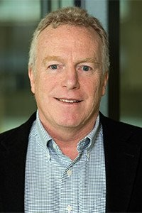

# Richard D. James

**Role:** Distinguished McKnight University Professor

**Category:** Faculty

**Email:** james@umn.edu

## Research summary

James studies changes in material structure, especially shape-memory materials, using mathematics at atomic and larger scales. His wider interests include origami-inspired structures, wind-turbine design, superconductivity, and superfluidity, with symmetry helping simplify complex problems.

## Easy research quiz

1. What special type of material is a major focus of James's work?
2. Does he study materials at atomic scales?
3. What paper-folding idea inspires some of his structures?
4. What energy device appears among his research interests?
5. What mathematical idea helps him simplify problems?

## Answer key

1. Shape-memory materials.
2. Yes.
3. Origami.
4. A wind turbine.
5. Symmetry.

## Sources and notes

AEM profile research description, paraphrased with brief plain-language explanations.

- [AEM faculty directory (name, role, email, photo)](https://cse.umn.edu/aem/aem-faculty)
- [AEM individual profile](https://cse.umn.edu/aem/richard-d-james)
- [Original photo](https://cse.umn.edu/sites/cse.umn.edu/files/styles/folwell_full/public/Jamesresized_1.jpeg.webp?itok=s1J5DgZb)
- Retrieved: 2026-09-26
- Photo status: directory_photo

