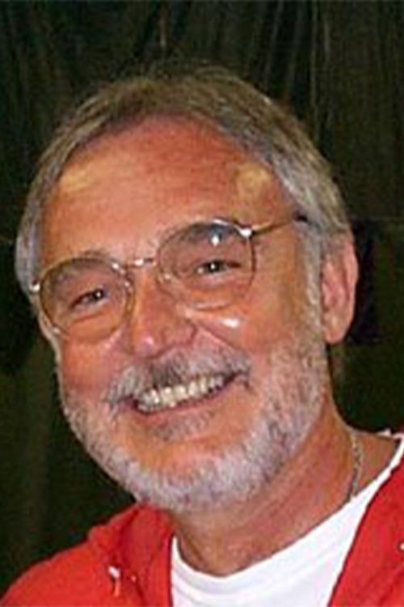

# Roger L. Fosdick

**Role:** Professor Emeritus (Retired 2013)

**Category:** Emeritus Faculty

**Email:** Not publicly listed in the current AEM directory/profile

## Research summary

Fosdick studies thermodynamics, continuum mechanics, and nonlinear material behavior using applied mathematics. His work addresses both practical problems and the foundational theories describing energy, forces, and deformation in materials.

## Easy research quiz

1. What field in Fosdick's work concerns heat and energy?
2. What mechanics framework is listed in his research?
3. Does he study nonlinear material behavior?
4. What tool does he use to analyze these problems?
5. Does his research address practical applications, foundations, or both?

## Answer key

1. Thermodynamics.
2. Continuum mechanics.
3. Yes.
4. Applied mathematics.
5. Both.

## Sources and notes

AEM profile research description, paraphrased with brief plain-language explanations.

- [AEM faculty directory (name, role, email, photo)](https://cse.umn.edu/aem/aem-faculty)
- [AEM individual profile](https://cse.umn.edu/aem/roger-l-fosdick)
- [Original photo](https://cse.umn.edu/sites/cse.umn.edu/files/styles/folwell_full/public/Fosdick%20Edit%20for%20Site.png.webp?itok=hCOddcRR)
- Retrieved: 2026-09-26
- Photo status: directory_photo
- The profile provides a short research description; the quiz includes basic explanations of those stated topics.
- No individual email is listed in the current AEM directory or linked profile. Department contact: aem-department@umn.edu (not the individual’s address).
