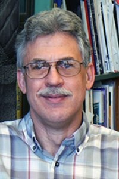

# Thomas W. Shield

**Role:** Professor Emeritus

**Category:** Emeritus Faculty

**Email:** shield@umn.edu

## Research summary

Shield studies how small-scale structures inside materials affect their overall behavior and how they crack. He combines experiments and models of shape-memory and magnetically responsive materials to support better actuators, sensors, and related devices.

## Easy research quiz

1. What internal features does Shield study?
2. What type of damage is central to his research?
3. Name one special material type he studies.
4. Does he use experiments, models, or both?
5. Name one device his research can help improve.

## Answer key

1. Microstructures or small-scale material structures.
2. Cracking or fracture.
3. Shape-memory or magnetically responsive materials.
4. Both.
5. An actuator or a sensor.

## Sources and notes

AEM profile research description, paraphrased with brief plain-language explanations.

- [AEM faculty directory (name, role, email, photo)](https://cse.umn.edu/aem/aem-faculty)
- [AEM individual profile](https://cse.umn.edu/aem/thomas-w-shield)
- [Original photo](https://cse.umn.edu/sites/cse.umn.edu/files/styles/folwell_full/public/shieldresized.jpg.webp?itok=sSwQUSlJ)
- Retrieved: 2026-09-26
- Photo status: directory_photo

