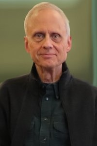

# Todd Helsa

**Role:** Contract Assistant Professor

**Category:** Teaching & Research Faculty

**Email:** hesla@umn.edu

## Research summary

Hesla studies how fluids interact with particles and solid bodies using theory and computer calculations. He also works on finite-element methods, which divide a problem into smaller pieces for numerical analysis.

## Easy research quiz

1. What does Hesla study interacting with fluids?
2. Does his research use theory?
3. Does his research use computer calculations?
4. What numerical method is named in his interests?
5. What does that method divide a problem into?

## Answer key

1. Particles and solid bodies.
2. Yes.
3. Yes.
4. The finite-element method.
5. Smaller pieces or elements.

## Sources and notes

AEM profile research description, paraphrased with brief plain-language explanations.

- [AEM faculty directory (name, role, email, photo)](https://cse.umn.edu/aem/aem-faculty)
- [AEM individual profile](https://cse.umn.edu/aem/todd-helsa)
- [Original photo](https://cse.umn.edu/sites/cse.umn.edu/files/styles/folwell_full/public/Heslaresized.jpg.webp?itok=4QeYT2wK)
- Retrieved: 2026-09-26
- Photo status: directory_photo
- The directory spells the name “Todd Helsa”; the linked profile and research text use “Todd Hesla.” The folder preserves the directory spelling.
