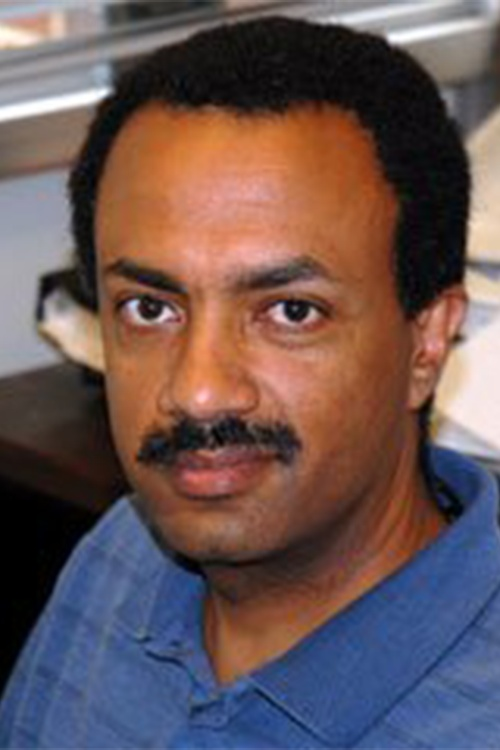

# Yohannes Ketema

**Role:** Professor & Director of Undergraduate Studies

**Category:** Faculty

**Email:** ketema@umn.edu

## Research summary

Ketema studies motion and stability, including spacecraft orbits, unmanned-aircraft paths, and vibration control using active materials. He also models human walking to estimate step size for pedestrian navigation.

## Easy research quiz

1. What broad subject unites Ketema's research?
2. What space-related paths does he study?
3. What unwanted motion can active materials help reduce?
4. What everyday human activity does he model?
5. Why estimate step size?

## Answer key

1. Dynamics, or the study of motion.
2. Spacecraft orbits and transfers between them.
3. Vibration.
4. Walking.
5. To help pedestrian navigation.

## Sources and notes

AEM profile research description, paraphrased with brief plain-language explanations.

- [AEM faculty directory (name, role, email, photo)](https://cse.umn.edu/aem/aem-faculty)
- [AEM individual profile](https://cse.umn.edu/aem/yohannes-ketema)
- [Original photo](https://cse.umn.edu/sites/cse.umn.edu/files/styles/folwell_full/public/Yohannes%20Ketema%20Headshot%20Website.png.webp?itok=NGSauIWE)
- Retrieved: 2026-09-26
- Photo status: directory_photo

